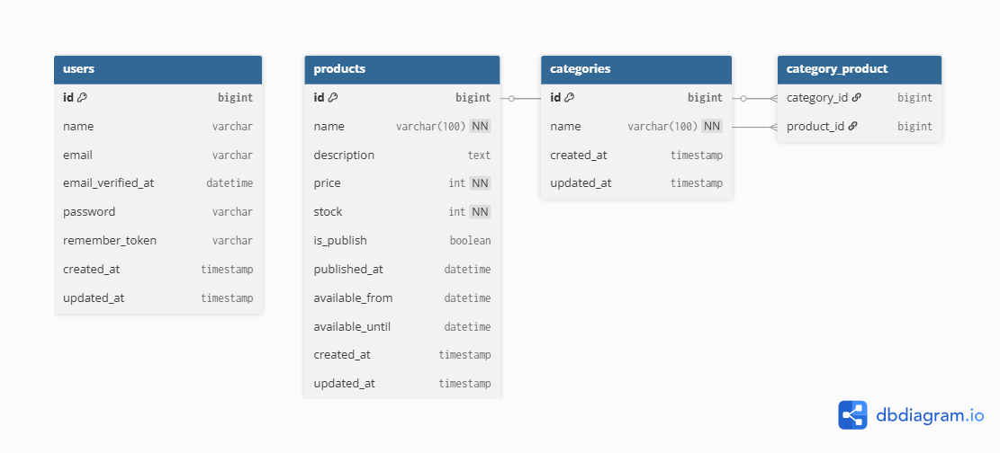

> [!CAUTION]
This repository is being rewritten in the 
[rewrite-e-commerce-webapp-with-stripe-sync](https://github.com/ts-dev-coder/rewrite-e-commerce-webapp-with-stripe-sync) repository, so this repository will be archived.

# 📌 Overview

This application is an e-commerce web app designed for selling both physical and digital products.  
It includes a payment feature using Stripe and implements the full shopping flow, including adding items to the cart and completing purchases.

This project was developed as part of [Recursion](https://recursionist.io/)'s "Backend Project 5: Server with Database" course.

# 📸 Demo
(to be added later)

# ⚙️ Features
- Product listing

- Product search / filtering

- Add to / remove from cart

- Purchase & payment (e.g., Stripe integration)

- User authentication (login / registration)

- Admin dashboard (e.g., inventory management)

# 🧱 Tech Stack
Frontend：Typescript / React / Tailwind / Shadcn-ui

Backend：PHP / Laravel

Database：MySQL

Others：Stripe / CodeRabbit(Code review)

# 🗂️ Database Schema

The following is the database schema diagram for this application:

> Please refer to [docs/db/](./docs/db/) for previous versions.

This diagram was created using `dbdiagram.io`, and the original source file can be found at `docs/db/ecommerce_schema.dbml`.

# 🧭Routes

## GET
- / : Top page
- /product/{id} : Product detal page
- /cart : Cart page
- /checkout : Checkout page
- /checkout/success : Order compolete
- /checkout/cancel : Order Cancel
- /login : Login page
- /register : Register page

## POST
- /login : Login
- /register : register
- /cart : Add product to the cart
- /checkout : submit the purchase procedure infomation

## PUT
- /cart/items/{item} : Update quantity of product in the cart

## DELETE
- /cart : Remove the product from the cart

## Stripe
- /webhook/stripe : Create the order if chekcout is success
